# un-api

OpenAPI 3 规范 API 构建器 - 自动从 OpenAPI 文档生成类型安全的 API 代码和 TypeScript 类型定义。

## 概述

`un-api` 是一个基于 OpenAPI 3.x 规范的 API 代码生成工具。它可以自动从 OpenAPI 文档生成：

- **类型安全的 API 请求代码** - 支持`Proxy`和`Memory`两种调用模式
- **完整的 TypeScript 类型定义** - 包含字段注释、约束条件、示例值等
- **四种导出方式** - `api`、`module`、`doc`、`default` 四种导出模式
- **内置常见平台插件-开箱即用** - 无缝集成到现代前端项目
- **彻底解放双手-告别重复劳动-手编误差** - 文档即代码-无需重复编写雷同请求代码-节约编码空间-排除人为失误
- **默认支持多实例架构** - 按照多文档设计整体架构-天然支持批量生成

## 核心特性

- 🎯 **完整的类型安全** - 自动生成精确的 TypeScript 类型，告别 any 类型
- 📝 **丰富的字段注释** - 自动从 Schema 生成 JSDoc 注释，包含描述、示例、约束等
- 🔧 **灵活的代码生成** - 支持自定义请求器、解析器、类型转换
- 📦 **零运行时依赖** - Browser 模块无任何 Node.js 依赖
- 🚀 **Vite 插件支持** - 一行配置即可集成
- 🎨 **Vue 响应式支持** - Proxy 模式自动添加 Vue 响应式跳过标记
- 🔄 **多种导出模式** - `api`、`module`、`doc`、`default` 四种导出模式满足任意代码规范
- 🌟 **两种API实现适配** - `Proxy`、`Memory`两种模式完美兼容框架项目-低版本环境实现-保持使用体验一致
- 🎭 **古法编程结果导向** - 生成的API、TS代码均尽可能参考手写代码风格-改动识别轻轻松松

## 快速开始

### 安装

```bash
pnpm add un-api
```

### 配置

项目根目录下创建 `un-api.config.ts`：

```typescript
import { defineConfig } from "un-api";

export default defineConfig({
  // ...公共doc配置(排除name、url外的所有属性都可在根对象配置(docs同级))
  docs: [
    {
      name: "example", // 每个文档配置的标识-必须
      url: "https://api.example.com/openapi.json", // 文档的获取地址-可以是本地相对地址
    },
  ],
});
```

### 使用 Vite 插件

```typescript
// vite.config.ts
import { defineConfig } from "vite";
// 所有平台插件命名=>平台名称+Plugin关键字
import { vitePlugin } from "un-api";

export default defineConfig({
  plugins: [vitePlugin()],
});
```

### 调用 API

```typescript
import { apiMyApi } from "./src/apis/example";

// 获取数据
const response = await apiMyApi.user.getById({
  params: { id: 1 },
});
```

## 文档导航

- **[最佳使用指南](/docs/best.md)** - 快速接入使用
- **[完整配置](/docs/config.md)** - 可配置项详尽说明
- **[TS类型编码](/docs/typescript.md)** - 完全把控类型生成+类型提示配置
- [API生成模块](/docs/browser.md) - 客户端生成API的方法
- [平台插件集成](/docs/platform.md) - 各平台内置插件、未内置平台适配
- [核心实现](/docs/core.md) - 核心生成逻辑全解析
- [axios三方库适配示例](/docs/axios-prefile.md) - axios三方库适配示例

## 生成的代码示例/效果

- 开发体验示例
  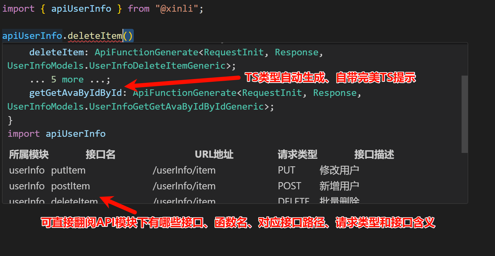
  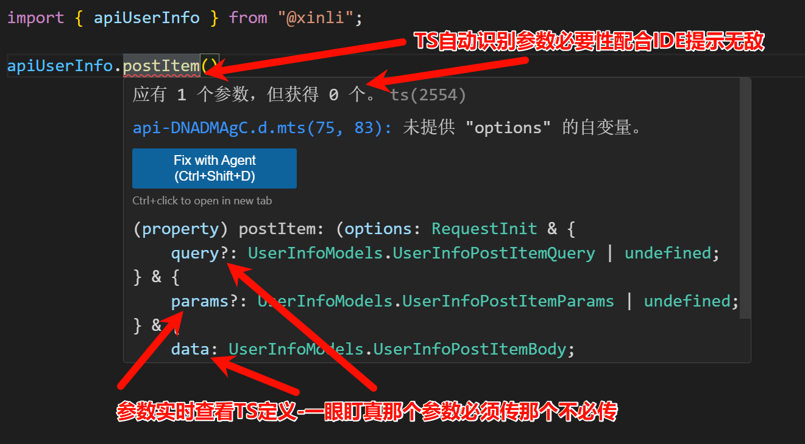
  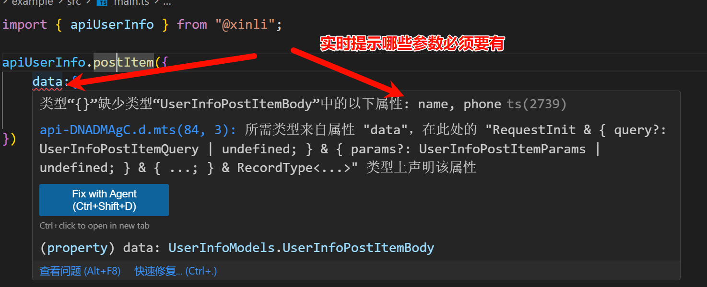
  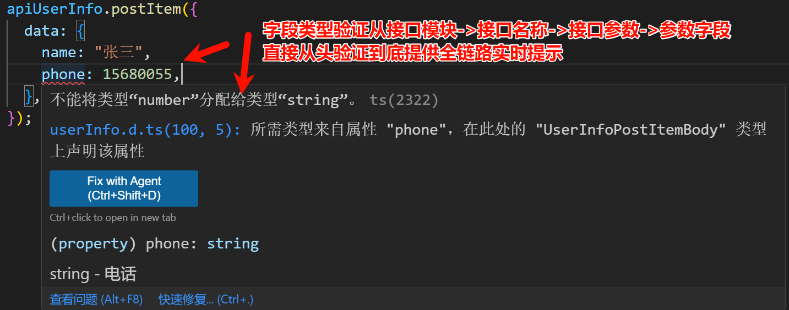
  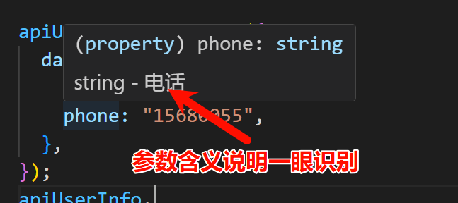
  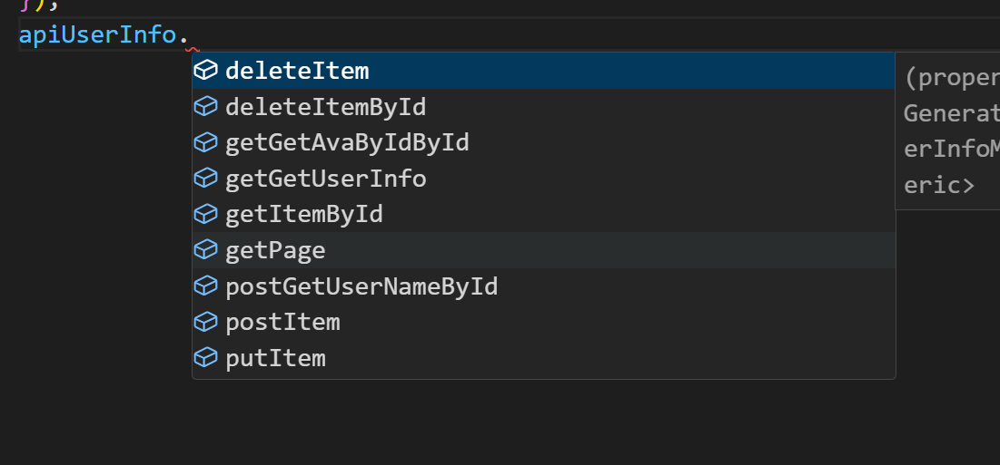
  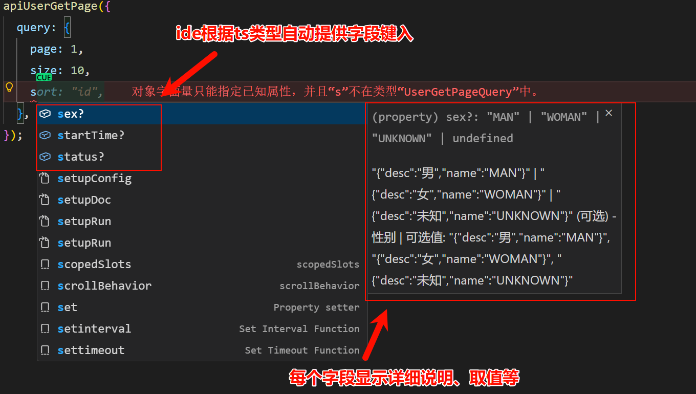
- 配置示例
  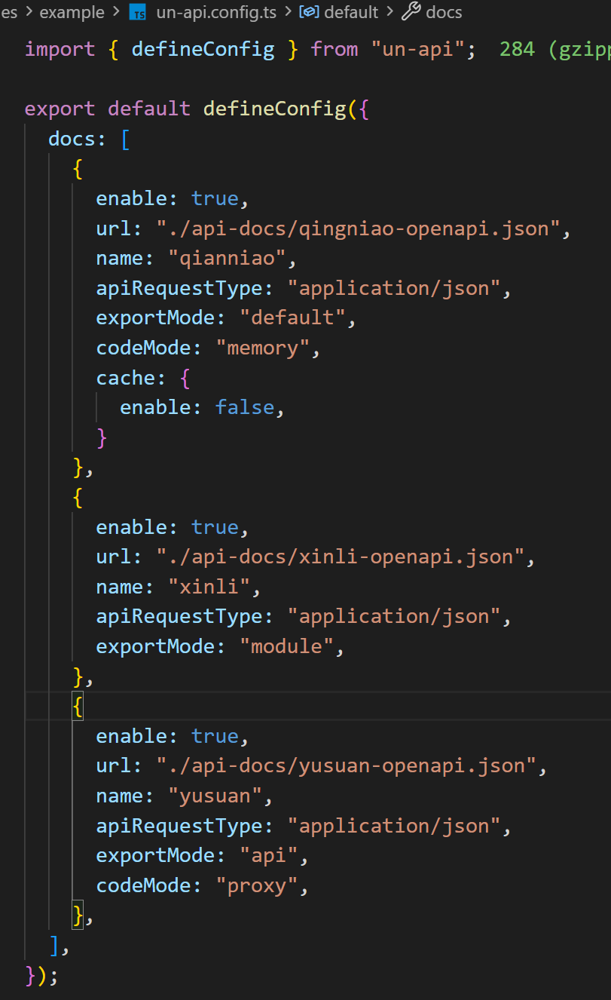
- 生成的API示例
  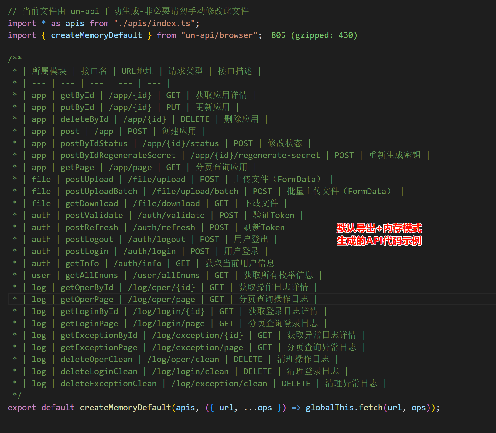
  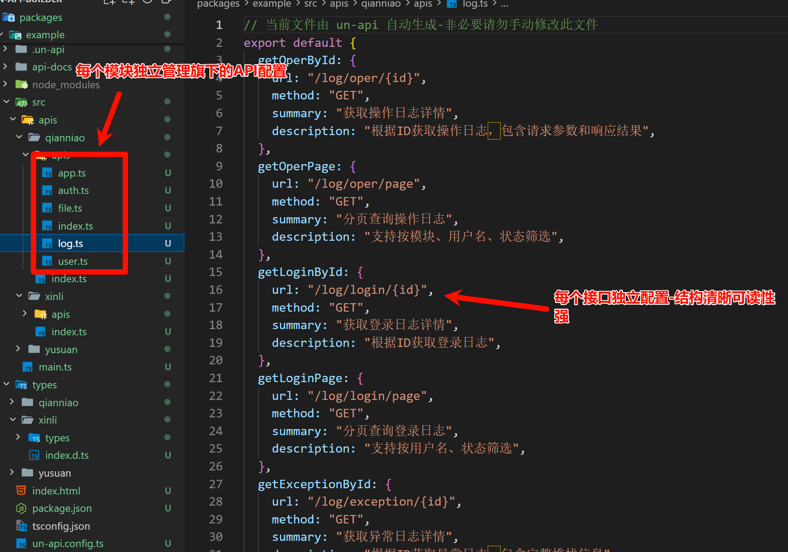
  
  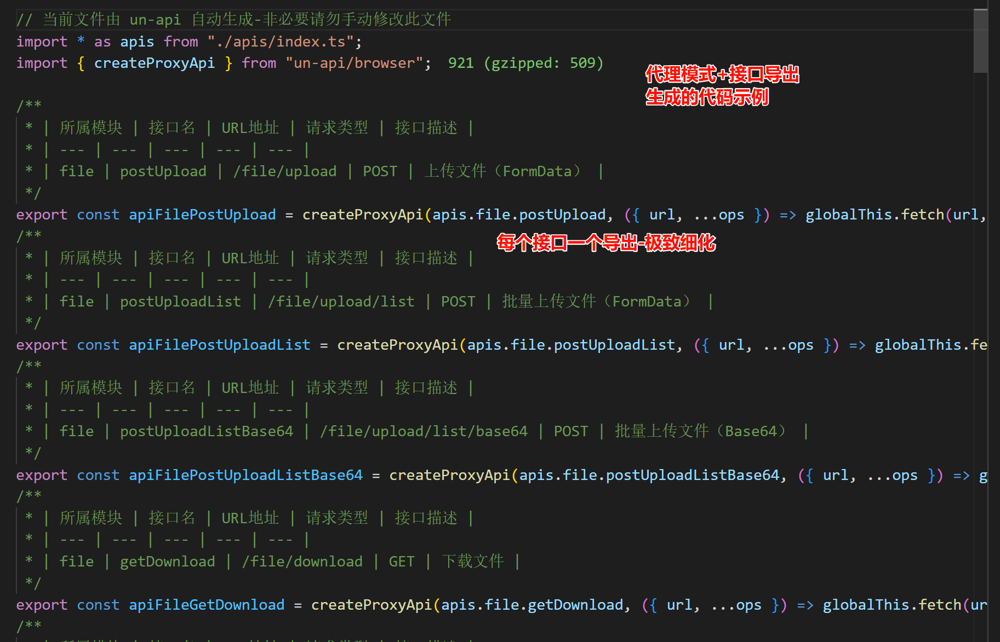
  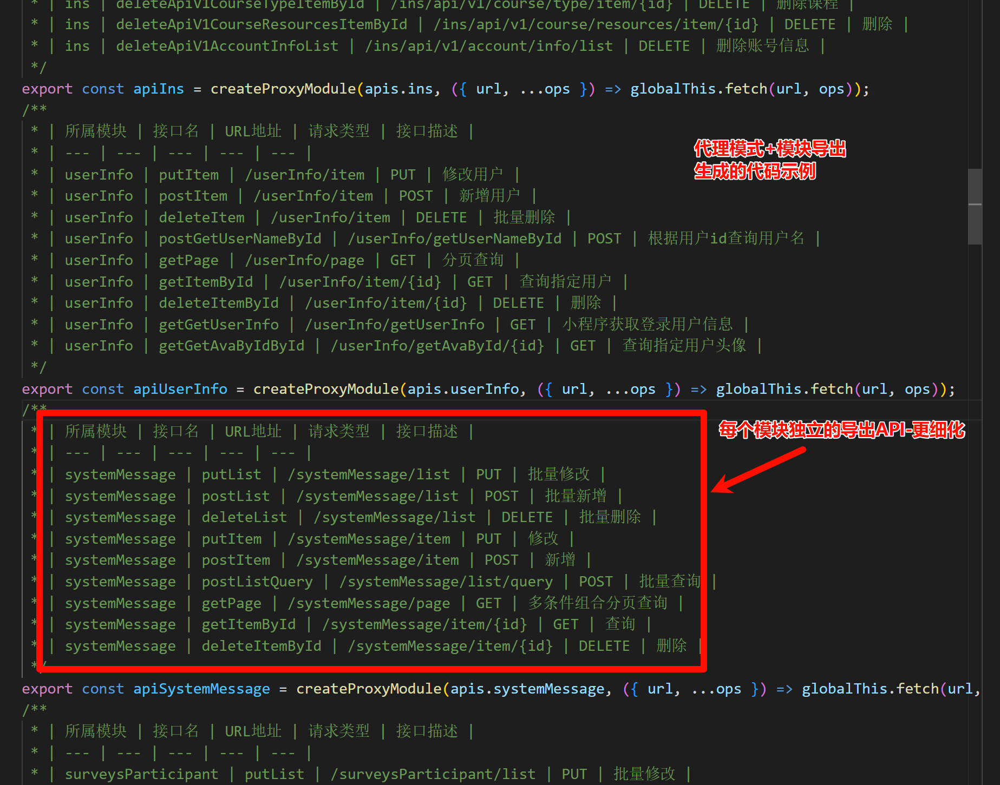
- 生成的TS类型示例
  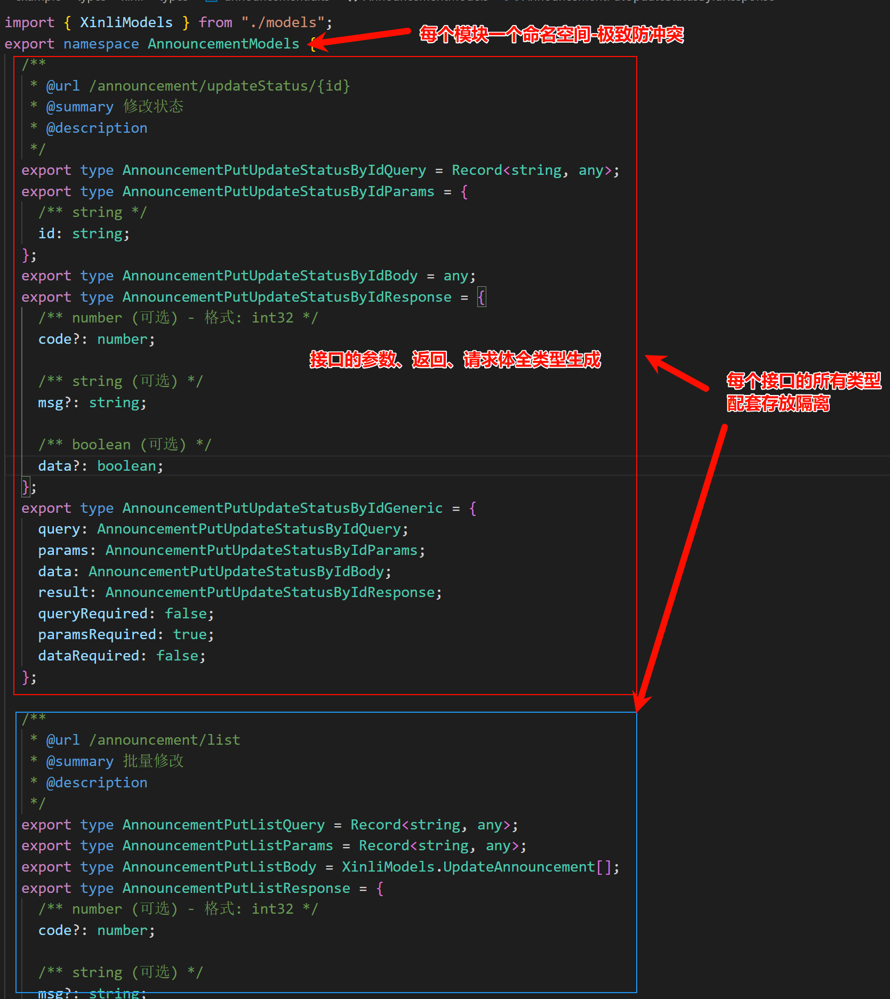
  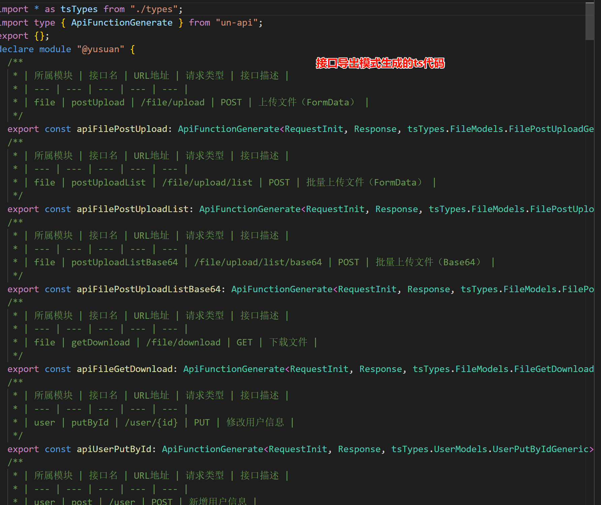
  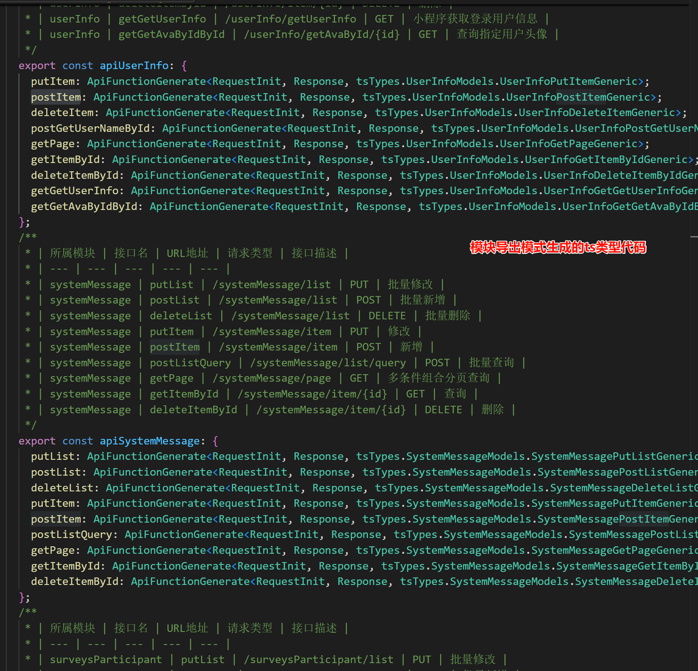

## 开发

```bash
# 安装依赖
pnpm install

# 构建包
pnpm build

# 运行测试
pnpm test

# 类型检查
pnpm typecheck
```

## 许可证

MIT
